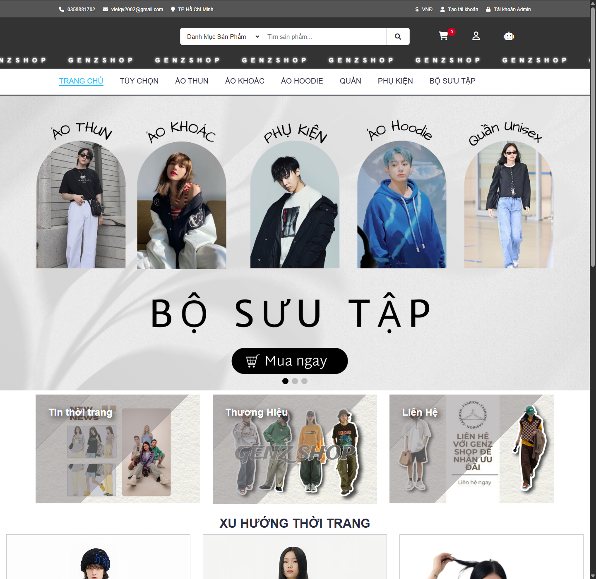
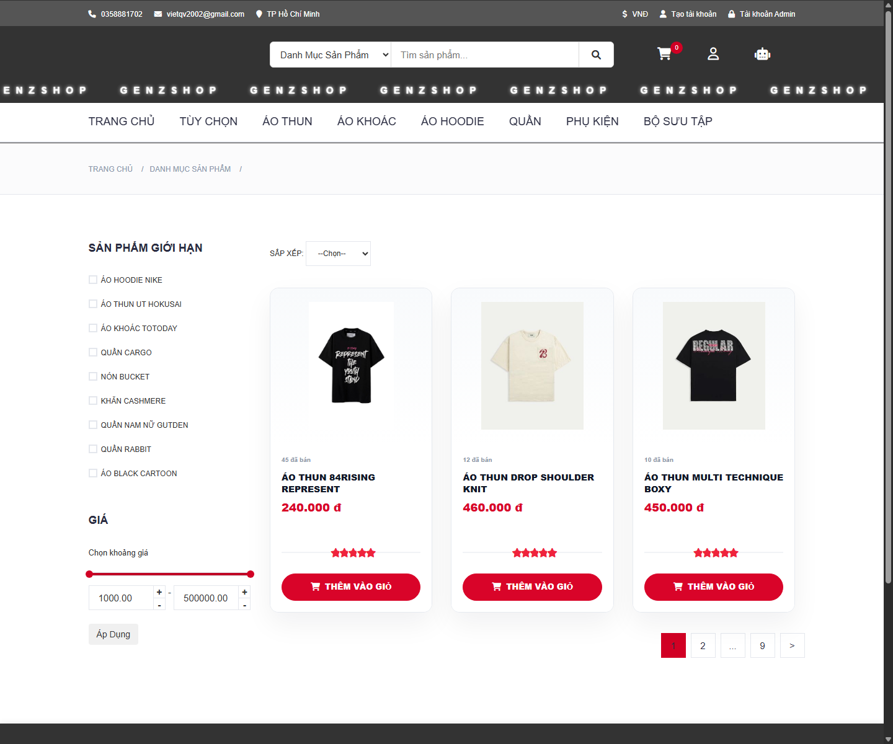
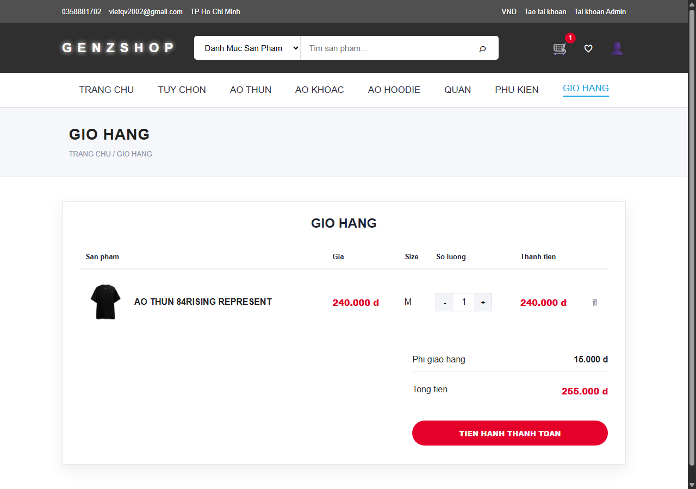
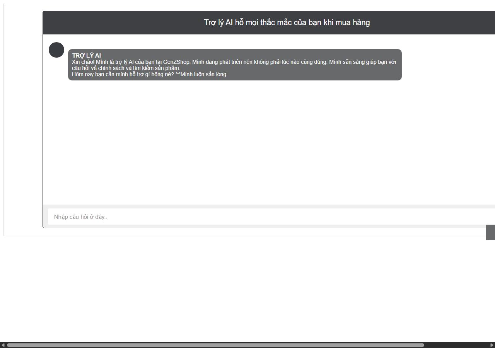
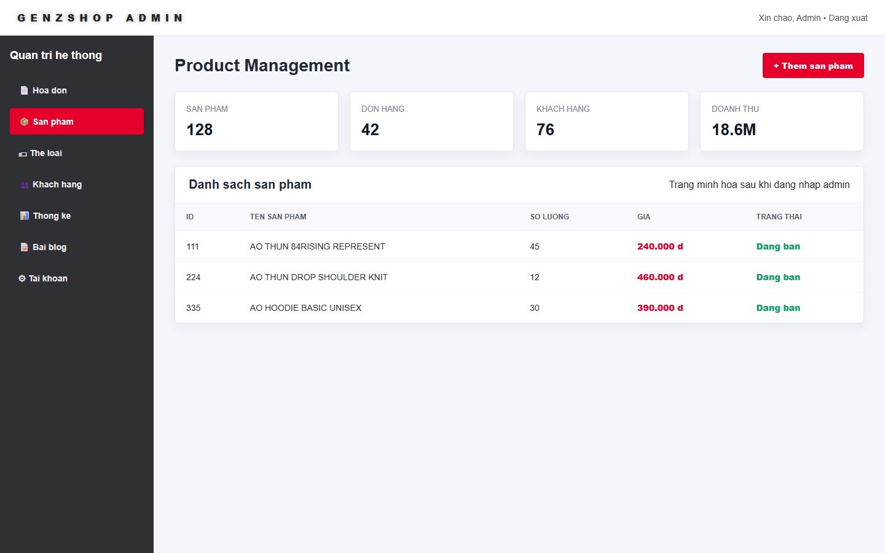

# 🚀 GenZShop – Intelligent E-Commerce Platform with AI Customer Assistant

> Transforming online shopping through intelligent customer support, personalized experiences, and automated retail management.


---

## 🌟 Introduction

GenZShop is a full-stack e-commerce platform designed to solve one of the most common challenges in online retail:

**Customers often struggle to find information, understand purchasing procedures, learn about promotions, and receive timely support.**

Traditional customer support requires human intervention, which increases operational costs and response times.

To address this problem, GenZShop integrates an **AI-powered chatbot assistant** that provides instant support, answers customer questions, and guides users throughout their shopping journey.

The platform combines modern e-commerce functionality with intelligent automation to create a more engaging and efficient shopping experience.

---

## 🎯 Problem Statement

Many online stores face several challenges:

* Customers do not understand how to place orders.
* Information about promotions is difficult to find.
* Shipping and return policies are often overlooked.
* Customer support teams receive repetitive questions daily.
* Customers leave websites when they cannot quickly find answers.

These issues can negatively impact customer satisfaction and reduce conversion rates.

---

## 💡 Solution

GenZShop introduces an integrated AI Customer Assistant capable of:

✅ Explaining the purchasing process

✅ Providing promotion and discount information

✅ Answering frequently asked questions

✅ Explaining shipping, payment, and return policies

✅ Assisting customers 24/7

✅ Improving customer engagement and shopping experience

The chatbot acts as a virtual sales consultant, helping customers make informed purchasing decisions while reducing the workload on support staff.

---

## 🏗️ System Architecture

```text
Customer
    │
    ▼
Frontend Interface
(HTML, CSS, JavaScript)
    │
    ▼
PHP Backend Services
    │
 ┌──┴───────────┐
 ▼              ▼
MySQL       Python Chatbot
Database     (Flask API)
```

The architecture separates business logic, data management, and AI services, making the system easier to maintain and scale.

---

## ✨ Core Features

### 🛒 Customer Module

* User Registration & Login
* Product Search & Filtering
* Product Detail Viewing
* Shopping Cart Management
* Checkout & Order Placement
* Order Tracking
* Customer Profile Management

### 🤖 AI Chatbot Module

* Product Consultation
* Shopping Process Guidance
* Promotion Information Support
* Shipping Policy Consultation
* Return & Refund Guidance
* FAQ Automation
* Real-time Customer Assistance

### 📊 Administration Module

* Product Management
* Category Management
* Supplier Management
* Customer Management
* Inventory Monitoring
* Order Processing
* Revenue Statistics
* Business Reporting

---

## 🛠️ Technologies Used

### Frontend

* HTML5
* CSS3
* Bootstrap
* JavaScript
* jQuery

### Backend

* PHP
* REST API

### AI & Automation

* Python
* Flask
* Natural Language Processing (NLP)

### Database

* MySQL

### Development Tools

* Git & GitHub
* VS Code
* XAMPP
* phpMyAdmin
* Postman

---

## 📈 Business Value

### For Customers

* Faster access to information
* Better shopping experience
* Instant support without waiting
* Easier product discovery

### For Businesses

* Reduced customer support workload
* Improved operational efficiency
* Enhanced customer satisfaction
* Increased customer retention

---

## 🔥 Project Highlights

✔ Full-Stack Web Development

✔ Database Design & Management

✔ AI Chatbot Integration

✔ Customer Service Automation

✔ Responsive User Interface

✔ Real-world Retail Business Workflow

✔ Scalable System Architecture

---

## 📷 System Screenshots

### Homepage



### Product Management



### Shopping Cart



### AI Chatbot Assistant



### Admin Dashboard



---

## 🚀 Future Improvements

* AI-based Product Recommendation System
* Customer Sentiment Analysis
* Voice-enabled Chatbot
* Personalized Promotion Engine
* Mobile Application Development
* Advanced Analytics Dashboard

---

## 👨‍💻 Author

**Ta Quoc Viet**

Information Technology Graduate

📧 Email: [vietqv2002@gmail.com](mailto:vietqv2002@gmail.com)

💻 GitHub: https://github.com/vietIT2002

---

## 📄 License

This project is developed for educational, research, and portfolio purposes.

All images and product information are used only for educational demonstration and demo purposes. They are not intended for commercialization, sale, or commercial promotion.
